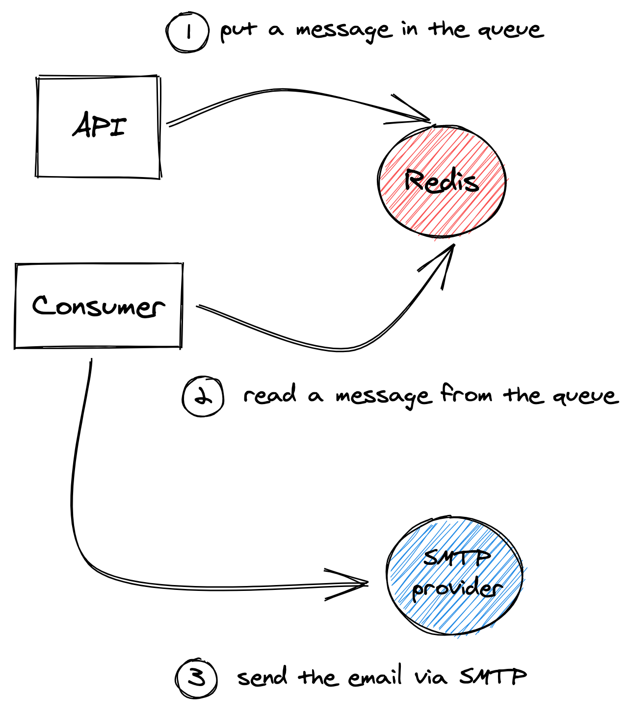

# Emails

This documentation will explain how sending emails works.

## Big picture



## Symfony Mailer and Symfony Messenger

The API uses [Symfony Mailer](https://symfony.com/doc/current/mailer.html) for sending emails and
[Symfony Messenger](https://symfony.com/doc/current/messenger.html) for doing it asynchronously.

Two advantages come with this asynchronous process:

* Sending emails does not slow your code execution.
* If one consumer cannot unstack the queue messages as fast as they arrive, you can add consumers on the fly to 
increase the unstack rate.

**Note:** in your development environment, the API and the consumer are one (the `make consume` command runs a command
inside the `api` service). In your remote environments (like production), the API and the consumer should be two 
different services (see [deployments](deployments/README.md) documentation for more details).

### Configuration

Most of the configuration comes from the following environment variables:

* `MAILER_DSN`: Data Source Name of the emails' server (format: `protocol//user:password@hostname:port`).
* `MESSENGER_TRANSPORT_DSN`: Data Source Name of the Redis service (format: `protocol//user:password@hostname:port/messages`)
* `MAIL_FROM_ADDRESS`: email address of the sender (usually `no-reply@your-domain.com`).
* `MAIL_FROM_NAME`: name of the sender (i.e., `MAIL_FROM_NAME<MAIL_FROM_ADDRESS>`).

**Note:** the Symfony parameters `app.mail_from_address` and `app.mail_from_name` take their values from the last two 
environment variables (see the [configuration](configuration.md) documentation for more details about parameters). 
The [src/api/src/UseCase/CreateEmail](../src/api/src/UseCase/CreateEmail.php) use case reads these parameters to 
fill the `form` property from the email - more on that in the next chapter.

### Code

We provide the abstract class [src/api/src/UseCase/CreateEmail](../src/api/src/UseCase/CreateEmail.php).
This class has a method `create`, which takes the following arguments:

* A recipient - [src/api/src/Domain/Model/User](../src/api/src/Domain/Model/User.php).
* A translation key for the email's subject (see [i18n](i18n.md) documentation for more details).
* A template's path (more on that in the next chapter).
* The template's context (i.e., the data of the template).

**Note:** this class does only create an `Email` object (it does not send it.).

You should extend this class to create your emails, for instance:

```php
final class CreateFooEmail extends CreateEmail
{
    public function createEmail(
        User $user,
        string $foo,
        string $bar
    ): TemplatedEmail {
        return $this->create(
            $user,
            'foo.subject',
            'emails/foo.html.twig', # Don't forget to prefix the path with "emails/".
            [
                'foo' => $foo,
                'bar' => $bar,
            ]
        );
    }
}
```

In the use case sending this email, you can inject both the previous class and the `MailerInterface`, i.e.:

```php
private MailerInterface $mailer;
private CreateFooEmail $createFooEmail;

public function __construct(
    MailerInterface $mailer,
    CreateFooEmail $createFooEmail
) {
    $this->mailer = $mailer;
    $this->createFooEmail = $createFooEmail;
}
```

You can then use them as below:

```php
$email = $this->createFooEmail->createEmail($user, $foo, $bar);
$this->mailer->send($email);
```

**Note:** always put your classes extending [CreateEmail](../src/api/src/UseCase/CreateEmail.php) on the same level as
the use case requiring it. See, for instance, the 
[src/api/src/UseCase/User/ResetPassword](../src/api/src/UseCase/User/ResetPassword) use case.

### Twig templates

The [src/api/templates/emails](../src/api/templates/emails) folder contains the Twig templates of the emails.

By default, all templates should extend the 
[src/api/templates/emails/emails.html.twig](../src/api/templates/emails/emails.html.twig) template. In other words,
the templates should only contain the body of the email, while the 
[emails.html.twig](../src/api/templates/emails/emails.html.twig) template contains the wrapping 
elements (header, footer, etc.).

Symfony provides the [Inky](https://get.foundation/emails/docs/inky.html) framework that converts simple HTML tags into 
the complex table HTML required for emails. For more details, you may also take a look at the 
[Symfony documentation](https://symfony.com/doc/current/mailer.html#inky-email-templating-language).

If you want to add new CSS rules, put them in the [src/api/assets/css/emails.css](../src/api/assets/css/emails.css) file.

Examples:

* [src/api/templates/emails/reset_password.html.twig](../src/api/templates/emails/reset_password.html.twig)
* [src/api/templates/emails/welcome_new_user.html.twig](../src/api/templates/emails/welcome_new_user.html.twig)

---

[Back to top](#emails) - [Home](../README.md)