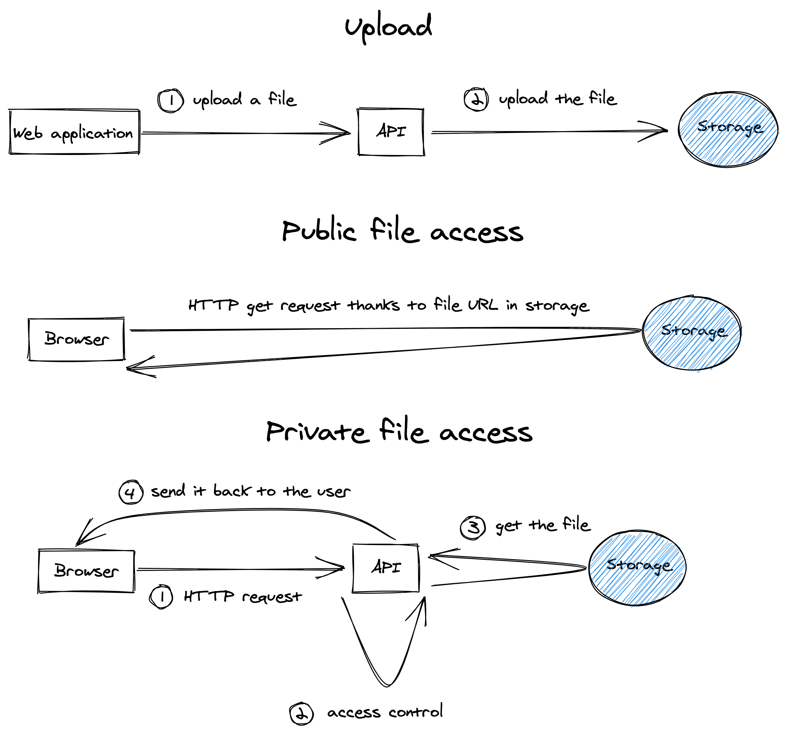

# Resources

This documentation will explain how to manage resources, i.e., assets, temporary files, and uploaded files.

## Assets

The application bundles assets, i.e., files like images, CSS, PDFs, etc.

On the web application, the [src/webapp/assets](../src/webapp/assets) folder contains these static files.
The Nuxt.js server serves them to the users through their browsers.

For instance, if you want to display an image to your users:

```vue
<template>
  
</template>

<script>
import fooImage from '@/assets/images/foo_image.png'

export default {
  data() {
    return {
      fooImageURL: fooImage,
    }
  },
}
</script>
```

On the API, the [src/api/assets](../src/api/assets) folder contains static files, mostly for the emails. 
The Apache server from the Docker image serves them to the users through their email viewers.

## Temporary files

Your API might have to manage temporary files, i.e., files you manipulate and forget.

A good option would be to save them in the [src/api/public](../src/api/public) folder (don't forget to update the
[src/api/public/.htaccess](../src/api/public/.htaccess) file for security) and delete them once your API has served them
to the user.

For instance:

```php
protected function createResponseWithXLSXAttachment(string $filename, Xlsx $xlsx): Response
{
    $tmpFilename = Uuid::uuid4()->toString() . '.xlsx';
    $xlsx->save($tmpFilename);
    $fileContent = file_get_contents($tmpFilename); // Get the file content.
    unlink($tmpFilename); // Delete the file.

    return $this->createResponseWithAttachment(
        $filename,
        $fileContent
    );
}
```

## Uploaded files

### Big picture



### MinIO - storage service

We use [MinIO](https://min.io/) as a storage service in the development environment. 
It uses the same API as AWS S3 so that you may easily replace it with your provider's storage service in production.

This storage is one of the steps to make the API stateless, meaning you may start/stop as many instances of your API 
without worrying about losing data or inconsistent behavior.

### API

Like the `Models` and `DAOs` classes for the data, we provide `Storables` and `Storages` classes for the uploaded files.

For instance, a [src/api/src/Domain/Model/Product](../src/api/src/Domain/Model/Product.php) can have pictures.

We created a [src/api/src/Domain/Model/Storable/ProductPicture](../src/api/src/Domain/Model/Storable/ProductPicture.php)
class that represents a picture. 
It extends from the [src/api/src/Domain/Model/Storable/Storable](../src/api/src/Domain/Model/Storable/Storable.php) class.

Your `Storables` classes have to implement the `getExtension` method from the [Storable](../src/api/src/Domain/Model/Storable/Storable.php)
class to validate the files' extensions.

You may also add your methods with validation annotations.

#### Create a storable from a source

A [Storable](../src/api/src/Domain/Model/Storable/Storable.php) contains useful methods for creating one or more 
instances according to a source:

```php
use App\Domain\Model\Storable\ProductPicture;
use Psr\Http\Message\UploadedFileInterface;

$storable = ProductPicture::createFromUploadedFile(
    /** @var UploadedFileInterface $picture */
   $picture
);

$storables = ProductPicture::createAllFromUploadedFiles(
    /** @var UploadedFileInterface[] $pictures */
   $pictures
);

$storable = ProductPicture::createFromPath(
    /** @var string $picture */
   $picture
);

$storables = ProductPicture::createAllFromPaths(
    /** @var string[] $pictures */
   $pictures
);
```

#### Write a storable to a storage

Pictures being public, we created a [src/api/src/Domain/Storage/ProductPictureStorage](../src/api/src/Domain/Storage/ProductPictureStorage.php)
class that extends the [src/api/src/Domain/Storage/PublicStorage](../src/api/src/Domain/Storage/PublicStorage.php) class.
For private files, the storage should extend the [src/api/src/Domain/Storage/PrivateStorage](../src/api/src/Domain/Storage/PrivateStorage.php)
class.

**Note:** both [PublicStorage](../src/api/src/Domain/Storage/PublicStorage.php) and [PrivateStorage](../src/api/src/Domain/Storage/PrivateStorage.php)
classes extend the [src/api/src/Domain/Storage/Storage/Storage](../src/api/src/Domain/Storage/Storage.php) class.

```php
$storable = ProductPicture::createFromUploadedFile(
    /** @var UploadedFileInterface $picture */
   $picture
);
$filename = $this->productPictureStorage->write($storable);
$product->setPicture($filename);


$storables = ProductPicture::createAllFromUploadedFiles(
    /** @var UploadedFileInterface[] $pictures */
   $pictures
);
$filenames = $this->productPictureStorage->writeAll($storables);
$product->setPictures($filenames);
```

As you can see, the [ProductPicture](../src/api/src/Domain/Model/Storable/ProductPicture.php) class is only useful 
for uploading the file to the storage. Your `Models` must save the random filename returned by the 
[Storage](../src/api/src/Domain/Storage/Storage.php).

The methods `write` and `writeAll` also validate the storable. If invalid, it throws a 
[src/api/src/Domain/Throwable/InvalidStorable](../src/api/src/Domain/Throwable/InvalidStorable.php) exception.
We will see how to handle this exception on the web application after.

**Note:** your `Storages` must implement the `getDirectoryName` method 
from the [Storage](../src/api/src/Domain/Storage/Storage.php)
class. 
In the storage service's bucket, it is the directory's name, which contains the files. 
We recommend using a Symfony parameter to hold a public directory name (coming itself from an environment variable). 
Indeed, the web application will need to know the directory name to create the public URL to the files 
from this directory, so it is better to use the same variable for your `api` and `webapp` services.

#### Delete a storable from a storage

```php
$filename = $product->getPicture();
$this->productPictureStorage->delete($filename);

$filenames = $product->getPictures();
$this->productPictureStorage->deleteAll($filenames);
```

**Note:** if you have a lot of files to delete, it might be better to do that action asynchronously.
See [src/api/src/UseCase/Product/DeleteProduct](../src/api/src/UseCase/Product/DeleteProduct.php).

#### Serve a private file

Public files are accessible from the storage service URL directly, but that's not the case for private files.

You must create a `Controller` with a Symfony route. Your controller will extend 
the [src/api/src/Infrastructure/Controller/DownloadController.php](../src/api/src/Infrastructure/Controller/DownloadController.php)
class that provides a `createResponseWithAttachment` method.

See [src/api/src/Infrastructure/Controller/Order/OrderInvoiceController.php](../src/api/src/Infrastructure/Controller/Order/OrderInvoiceController.php)
for a complete example.

#### Configuration

We use [Flysystem](https://github.com/thephpleague/flysystem) to abstract the storage service in our source code.

We configured this package in the [src/api/config/packages/flysystem.yaml](../src/api/config/packages/flysystem.yaml) 
configuration file.

There are two kinds of storage:

* Public for files available to everyone.
* Private for files requiring access control.

In our implementation with [MinIO](https://min.io/), we use two buckets (sort of disks with access policies).

We create the two buckets thanks to the 
[src/api/src/Infrastructure/Command/InitializeS3StorageCommand.php](../src/api/src/Infrastructure/Command/InitializeS3StorageCommand.php)
command:

```bash
php bin/console app:init-storage:s3
```

**Note:** in your development environment, the service `api` runs this command automatically on startup.

Let's go back to the configuration:

```yaml
public.storage.s3:
    adapter: 'aws'
    options:
        client: 's3.client'
        bucket: '%env(STORAGE_PUBLIC_BUCKET)%'

public.storage.memory:
    adapter: 'memory'

public.storage:
    adapter: 'lazy'
    options:
        source: '%env(STORAGE_PUBLIC_SOURCE)%'
```

The service `public.storage` is the generic Symfony service used in our source code. 
Thanks to its `source` option, we tell the [Flysystem](https://github.com/thephpleague/flysystem) package to use either
the `public.storage.s3` service (development, maybe other environments) or `public.storage.memory` service (tests).

It works the same for private storage.

### Web application

#### Public file URL

In the `publicRuntimeConfig` property of your [../src/webapp/nuxt.config.js](../src/webapp/nuxt.config.js), you can
add base URLs of your public bucket's directories. For instance:

```js
publicRuntimeConfig: {
  productPictureURL:
    process.env.PUBLIC_STORAGE_URL +
    process.env.PUBLIC_STORAGE_PRODUCT_PICTURE +
    '/',
}
```

You may then concatenate the filename to this URL in your component:

```js
this.$config.productPictureURL + this.product.picture
```

Or in your template:

```js
<template>
    
</template>
```

#### Private file URL

Use the `$config.apiURL` and concatenate the Symfony route of your Controller.

#### Uploads

Examples:

* Create: [src/webapp/pages/products/create/_companyId.vue](../src/webapp/pages/products/create/_companyId.vue).
* Update: [src/webapp/pages/products/_id/edit.vue](../src/webapp/pages/products/_id/edit.vue).

**Note:** in case of `InvalidStorable`, errors are available under the directory name key (i.e., 
for product pictures its `product_picture`).

---

[Back to top](#resources) - [Home](../README.md)